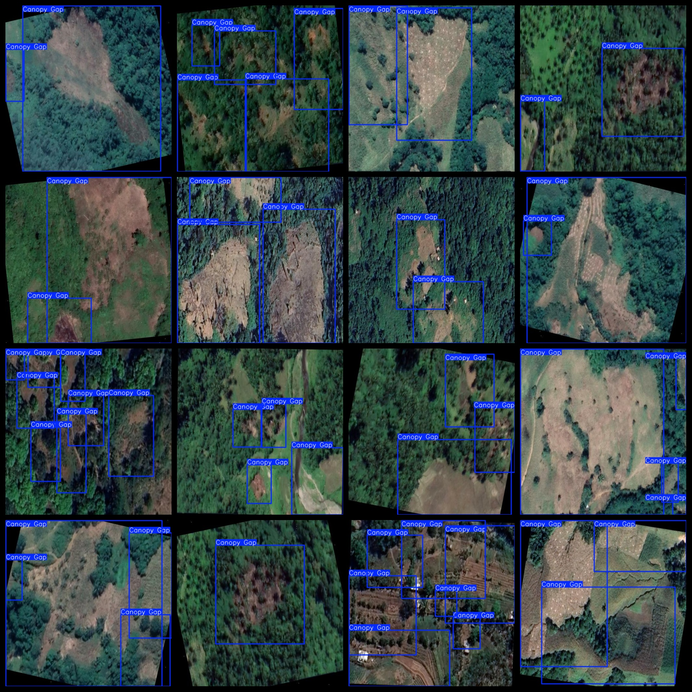

# 【】『』「」<>[]
3346 imagesVOC+YOLO

Data set format: Pascal VOC format + YOLO format (without split path in txt file, only including jpg images and corresponding VOC format xml files and YOLO format txt files)

Number of images (jpg files): 3346

Number of annotations (xml files): 3346

Number of annotations (txt files): 3346

Number of annotation categories: 1

Repository: datasets_sl

Annotation category names: ["Canopy Gap"]

Number of boxes for each category:

Canopy Gap boxes = 10892

Total boxes: 10892

Number of images per category:

Canopy Gap images = 3346

Image resolution: 512x512

Annotation tool used: labelImg

Is the dataset enhanced? Yes

Annotation rules: draw a box around the category with number 08.

Important note: The dataset does not have a division into training, validation, and testing sets; you need to divide it yourself.

Special declaration: This dataset does not guarantee the accuracy of the trained model or weight files.

Annotation and image situation is as follows:

## Images

---

Here is a pay link on Stripe (https://buy.stripe.com/3cs8yP7sY87d0vu9AB). Please contact me lonlonago@foxmail.com after funding $89, and I will send you a complete data files, thank you!

